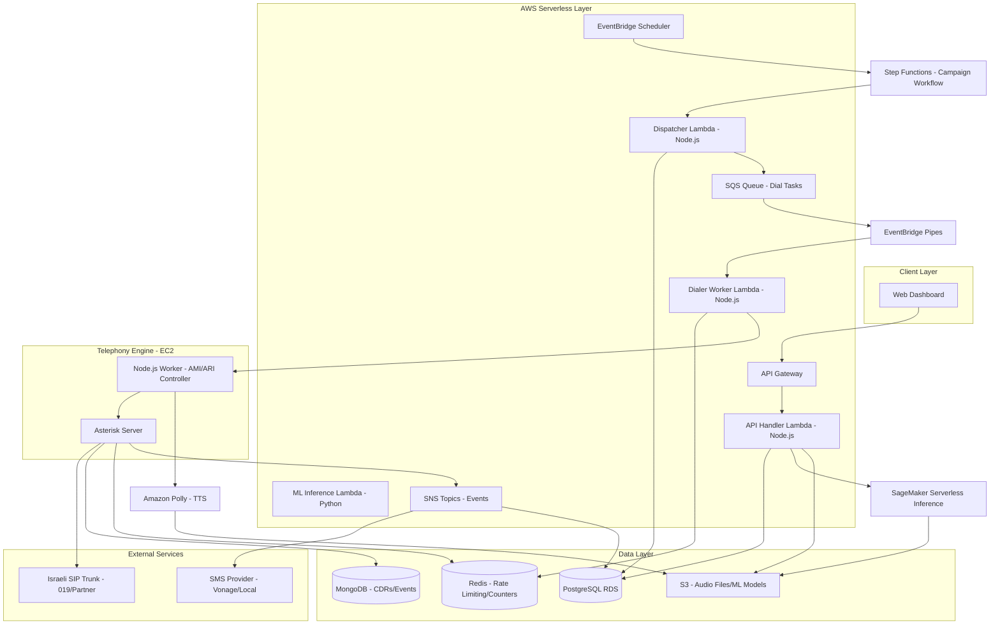

# Design Document

## Overview

The Mass Voice Campaign System is built on a hybrid serverless architecture optimized for the Israeli market, designed to handle bursty traffic (0 to 10,000 concurrent calls) with a scale-to-zero cost model. The system combines AWS serverless services (Lambda, SQS, SNS) for business logic with a self-hosted Asterisk telephony engine connected to local Israeli SIP trunks for cost-effective voice termination.

The architecture follows a "Serverless-First" philosophy for compute and logic, while using a dedicated EC2 instance running Asterisk for telephony operations. This hybrid approach minimizes operational costs during idle periods while maintaining the ability to scale rapidly during campaign execution.

### Key Design Principles

1. **Serverless-First**: AWS Lambda for all business logic to achieve scale-to-zero economics
2. **BYOC (Bring Your Own Carrier)**: Self-hosted Asterisk with local Israeli SIP trunks to minimize telephony costs
3. **Cost Optimization**: Pay only for actual usage, $0 cost when idle
4. **Bursty Traffic Handling**: Architecture designed for rapid scaling from 0 to 10,000 concurrent calls
5. **Event-Driven Architecture**: Asynchronous message processing via SQS/SNS enables loose coupling and high throughput
6. **Polyglot Persistence**: PostgreSQL for transactional data, MongoDB for CDRs/events, Redis for real-time operations
7. **Infrastructure as Code**: Terraform for provisioning, Ansible for configuration, GitHub Actions for CI/CD

## Architecture

### High-Level Architecture Diagram



### Technology Stack

**Compute & Logic**:
- **AWS Lambda**: Dockerized containers running Node.js (TypeScript) for business logic, Python for ML
- **API Gateway**: REST API endpoint for web dashboard
- **EventBridge**: Scheduled triggers for campaign dispatch
- **Step Functions**: Orchestrates complex campaign workflows with built-in error handling and retry logic
- **EventBridge Pipes**: Connects SQS to Lambda with filtering and transformation

**Telephony Engine**:
- **Asterisk**: Self-hosted on dedicated EC2 instance (c5.large or c5.xlarge) with Elastic IP
- **Node.js Worker**: AMI/ARI controller for Asterisk call control
- **Future Scaling**: Kamailio as SIP proxy for Asterisk ASG when vertical scaling limits are reached

**Data Layer**:
- **PostgreSQL (AWS RDS)**: Transactional data, users, campaigns, blacklist, billing
- **MongoDB (Atlas or Self-Hosted)**: Call Detail Records (CDRs), event logs, ML training data
- **Redis (ElastiCache or Self-Hosted on EC2)**: Rate limiting (CPS), live dashboard counters, dedup cache
- **S3**: Audio files, ML model artifacts (.pkl), campaign reports

**Async Processing**:
- **AWS SQS**: Standard queue for dial tasks, buffers between logic and telephony
- **AWS SNS**: Fan-out events (donations, opt-outs) to trigger SMS, email, DB updates

**Machine Learning**:
- **Training**: Scheduled task (SageMaker Training Jobs) generates model artifacts stored in S3
- **Inference**: SageMaker Serverless Inference endpoints for real-time contact scoring (auto-scales, pay-per-inference)

**Text-to-Speech**:
- **Amazon Polly**: Neural TTS for Hebrew and English voices, $4 per 1M characters
- **Audio Caching**: Generated speech cached in S3 for reuse

**DevOps & Infrastructure**:
- **Terraform**: Infrastructure provisioning (AWS resources, networking, security)
- **Ansible**: Configuration management (Asterisk setup, Node.js worker deployment)
- **GitHub Actions**: CI/CD pipeline for automated testing and deployment
- **Docker**: Container images for Lambda functions

**Monitoring**:
- **CloudWatch**: Logs, metrics, alarms for Lambda and EC2
- **CloudWatch Dashboards**: Real-time campaign monitoring
- **X-Ray**: Distributed tracing for Lambda functions

**Frontend & User Interface**:
- **Framework**: React 18 with TypeScript
- **State Management**: Redux Toolkit for global state, React Query for server state
- **UI Library**: Material-UI (MUI) or Ant Design for enterprise-grade components
- **Build Tool**: Vite for fast development and optimized production builds
- **Hosting**: AWS S3 + CloudFront for static site hosting with global CDN
- **Real-time Updates**: WebSocket connection via API Gateway WebSocket API for live dashboard

**Authentication & Authorization**:
- **Identity Provider**: AWS Cognito User Pools
- **Authentication Flow**: OAuth 2.0 / OpenID Connect
- **MFA Support**: SMS and TOTP (Time-based One-Time Password) via Cognito
- **User Roles**: Campaign Manager, Administrator, Analyst (RBAC via Cognito Groups)
- **Session Management**: JWT tokens with 1-hour expiration, refresh tokens for 30 days
- **Password Policy**: Enforced via Cognito (min 8 chars, uppercase, lowercase, numbers, symbols)

## Frontend Architecture

### Web Dashboard Components

**Technology Stack**:
- **React 18**: Component-based UI with hooks and concurrent features
- **TypeScript**: Type safety and better developer experience
- **Redux Toolkit**: Centralized state management for campaigns, contacts, user session
- **React Query**: Server state management with automatic caching and refetching
- **Material-UI (MUI)**: Pre-built components for forms, tables, charts, dialogs
- **Recharts**: Data visualization for analytics dashboard
- **React Hook Form**: Form validation and submission
- **Axios**: HTTP client for API calls with interceptors for auth tokens

**Key Features**:

1. **Campaign Management**
   - Create/edit campaign wizard with step-by-step flow
   - Campaign list with filtering, sorting, pagination
   - Campaign detail view with real-time metrics

2. **Contact Upload**
   - Drag-and-drop Excel file upload
   - CSV/XLSX parsing with validation feedback
   - Bulk import progress indicator
   - Database sync configuration UI

3. **Audio Recording**
   - **In-Browser Recording**: WebRTC MediaRecorder API for recording campaign messages
   - **File Upload**: Support for MP3/WAV file uploads
   - **Phone-In Recording**: Display phone number for users to call and record message
   - **Audio Preview**: Playback recorded audio before campaign creation
   - **Audio Library**: Reusable audio files stored in S3

4. **IVR Flow Builder**
   - Visual drag-and-drop IVR flow designer
   - Node types: Play Audio, Capture Input, Menu, Action
   - DTMF mapping configuration
   - Flow validation before campaign creation

5. **Real-Time Dashboard**
   - Live metrics: Active calls, queue depth, dialing rate
   - Campaign progress: Answered, busy, failed, converted, opt-outs
   - WebSocket connection for real-time updates (no polling)
   - Auto-refresh every 2 seconds for critical metrics

6. **Analytics & Reporting**
   - Historical campaign performance charts
   - Campaign comparison view
   - Export reports (CSV, Excel, PDF)
   - Date range filtering

7. **Blacklist Management**
   - Upload blacklist files
   - Manual add/remove numbers
   - View opt-out history
   - Export blacklist

### Authentication Flow

**User Registration & Login**:
1. User visits dashboard → Redirected to Cognito Hosted UI
2. User signs up with email/password
3. Cognito sends verification email
4. User verifies email and logs in
5. Cognito returns JWT access token and refresh token
6. Frontend stores tokens in secure httpOnly cookies
7. API Gateway validates JWT on every request

**MFA Setup**:
- Users can enable MFA in profile settings
- Cognito supports SMS or TOTP (Google Authenticator, Authy)
- MFA required for admin users (enforced via Cognito policy)

**Session Management**:
- Access token expires after 1 hour
- Frontend automatically refreshes token using refresh token
- Refresh token expires after 30 days (user must re-login)
- Logout clears tokens and invalidates session

### Audio Recording Implementation

**Option 1: In-Browser Recording (Recommended)**
```typescript
// Using MediaRecorder API
const startRecording = async () => {
  const stream = await navigator.mediaDevices.getUserMedia({ audio: true });
  const mediaRecorder = new MediaRecorder(stream);
  const audioChunks: Blob[] = [];
  
  mediaRecorder.ondataavailable = (event) => {
    audioChunks.push(event.data);
  };
  
  mediaRecorder.onstop = async () => {
    const audioBlob = new Blob(audioChunks, { type: 'audio/wav' });
    const formData = new FormData();
    formData.append('audio', audioBlob, 'campaign-message.wav');
    
    // Upload to S3 via presigned URL
    const { uploadUrl } = await api.getAudioUploadUrl();
    await axios.put(uploadUrl, audioBlob);
  };
  
  mediaRecorder.start();
};
```

**Option 2: Phone-In Recording**
- System provides a dedicated phone number (via Twilio or local carrier)
- User calls number and records message after beep
- Recording stored in S3 automatically
- User sees recording appear in dashboard within seconds

**Option 3: File Upload**
- User uploads pre-recorded MP3/WAV file
- Frontend validates file format and size (max 10MB)
- Upload to S3 via presigned URL (no Lambda involvement)
- Audio file URL stored in campaign configuration

### Deployment

**Frontend Hosting**:
- Build React app: `npm run build` → static files in `dist/`
- Upload to S3 bucket: `aws s3 sync dist/ s3://campaign-dashboard-bucket/`
- CloudFront distribution serves S3 content with:
  - HTTPS only (SSL certificate via ACM)
  - Custom domain (e.g., dashboard.example.com)
  - Gzip compression enabled
  - Cache invalidation on deployment

**CI/CD Pipeline** (GitHub Actions):
```yaml
name: Deploy Frontend
on:
  push:
    branches: [main]
jobs:
  deploy:
    runs-on: ubuntu-latest
    steps:
      - uses: actions/checkout@v3
      - uses: actions/setup-node@v3
      - run: npm ci
      - run: npm run build
      - run: aws s3 sync dist/ s3://campaign-dashboard-bucket/
      - run: aws cloudfront create-invalidation --distribution-id $DIST_ID --paths "/*"
```

## Campaign Execution Flow

### End-to-End Data Flow

1. **Contact Ingestion**
   - User uploads Excel file via Web Dashboard
   - API Gateway → API Handler Lambda
   - Lambda validates file format and parses contacts
   - Lambda calls SageMaker Serverless Inference endpoint to score each contact
   - Contacts stored in PostgreSQL with optimal call time predictions

2. **Campaign Scheduling**
   - User configures campaign (schedule, time windows, IVR flow)
   - Campaign stored in PostgreSQL with status "scheduled"
   - EventBridge rule created for campaign start time

3. **Campaign Workflow Orchestration (Step Functions)**
   - EventBridge triggers Step Functions state machine at scheduled time
   - State machine orchestrates campaign execution with built-in retry and error handling:
     - **State 1**: Validate campaign configuration
     - **State 2**: Query eligible contacts (parallel execution)
     - **State 3**: Batch contacts and push to SQS
     - **State 4**: Monitor campaign progress
     - **State 5**: Generate completion report
   - Step Functions provides visual workflow monitoring and automatic retries

4. **Campaign Dispatch**
   - Dispatcher Lambda (invoked by Step Functions) queries PostgreSQL for eligible contacts:
     - Not blacklisted
     - Within calling time window (considering timezone)
     - Not exceeded max attempts
     - Prioritized by ML-predicted optimal time
   - Dispatcher pushes dial tasks to SQS queue

5. **Rate-Limited Dialing (EventBridge Pipes + Lambda)**
   - EventBridge Pipes connects SQS to Dialer Worker Lambda with:
     - Built-in filtering (e.g., skip blacklisted numbers)
     - Message transformation (enrich with campaign config)
     - Automatic batching (batch of 10 messages)
   - Dialer Worker Lambda processes batch:
     - Check Redis for current CPS (calls per second) rate
     - If under limit, increment Redis counter (with 1-second TTL)
     - Send dial command to Node.js Worker via HTTP/WebSocket
   - If over limit, Pipes handles retry with exponential backoff

6. **Call Execution**
   - Node.js Worker receives dial command
   - Worker generates Asterisk call file or uses AMI/ARI to originate call
   - Asterisk dials via SIP trunk to Israeli carrier
   - Call states tracked: DIALING → RINGING → ANSWERED

7. **IVR Interaction**
   - On answer, Asterisk plays pre-recorded audio message
   - Asterisk waits for DTMF input (timeout: 10 seconds)
   - DTMF events sent to Node.js Worker
   - Worker processes input:
     - Press 1: Publish to SNS `donation-events` topic
     - Press 9: Publish to SNS `optout-events` topic
     - Invalid key: Play error message, repeat menu
     - Timeout: Play timeout message, end call

8. **Post-Call Actions**
   - **Donation Flow (Press 1)**:
     - SNS `donation-events` triggers SMS Lambda
     - SMS Lambda sends message with donation link via Vonage/Local provider
     - If SMS fails (landline detected), trigger TTS fallback
     - Node.js Worker calls Amazon Polly to synthesize speech (Hebrew/English)
     - Polly returns audio URL (cached in S3)
     - Worker initiates fallback call with synthesized speech
   
   - **Opt-Out Flow (Press 9)**:
     - SNS `optout-events` triggers Blacklist Lambda
     - Lambda adds number to PostgreSQL blacklist table
     - Lambda updates Redis cache for fast blacklist lookups
     - Call terminated immediately

9. **Event Logging**
   - All call events (answer, DTMF, hangup) written to MongoDB
   - CDR (Call Detail Record) created with:
     - Call ID, campaign ID, contact ID
     - Start time, end time, duration
     - Outcome (answered, busy, failed, converted, opted-out)
     - DTMF inputs, actions triggered
     - Cost calculation
   - Redis counters updated for live dashboard

10. **Real-Time Analytics**
   - Dashboard polls API Gateway → Analytics Lambda
   - Lambda queries Redis for live metrics (active calls, queue depth)
   - Lambda queries PostgreSQL for campaign progress
   - Dashboard updates every 2 seconds

11. **Campaign Completion (Step Functions)**
    - Step Functions monitors campaign progress
    - When all contacts processed, state machine transitions to completion state
    - Report Generator Lambda invoked by Step Functions
    - Lambda aggregates data from PostgreSQL and MongoDB
    - Report generated (CSV/Excel/PDF) and stored in S3
    - Step Functions sends SNS notification to user with download link
    - State machine execution completes with success status

## Components and Interfaces

### 1. API Handler Lambda (Campaign Manager)


**Responsibilities**:
- Campaign CRUD operations
- Contact list ingestion (Excel, database sync)
- Campaign scheduling and time window management
- Blacklist management
- Campaign lifecycle orchestration

**Key Interfaces**:

```typescript
interface CampaignManagerAPI {
  createCampaign(config: CampaignConfig): Promise<Campaign>;
  uploadContactList(campaignId: string, file: File): Promise<ImportResult>;
  syncContactsFromDatabase(campaignId: string, dbConfig: DatabaseConfig): Promise<ImportResult>;
  scheduleCampaign(campaignId: string, schedule: Schedule): Promise<void>;
  pauseCampaign(campaignId: string): Promise<void>;
  resumeCampaign(campaignId: string): Promise<void>;
  addToBlacklist(phoneNumbers: string[]): Promise<void>;
  removeFromBlacklist(phoneNumbers: string[]): Promise<void>;
}

interface CampaignConfig {
  name: string;
  type: 'voice' | 'sms' | 'hybrid';
  audioFileUrl?: string;
  smsTemplate?: string;
  ivrFlow?: IVRFlowDefinition;
  schedule: Schedule;
  callingWindows: TimeWindow[];
  maxConcurrentCalls?: number;
}

interface Schedule {
  startTime: Date;
  endTime: Date;
  timezone: string;
}

interface TimeWindow {
  dayOfWeek: number[];
  startHour: number;
  endHour: number;
}
```

### 2. Call Orchestrator Service

**Responsibilities**:
- Manages call queue and dialing pace
- Blacklist filtering before dialing
- Adaptive rate limiting based on system health
- Call state management
- Integration with ML Engine for optimal scheduling

**Key Interfaces**:

```typescript
interface CallOrchestratorAPI {
  initiateCall(contact: Contact, campaign: Campaign): Promise<CallSession>;
  getCallStatus(callId: string): Promise<CallStatus>;
  terminateCall(callId: string): Promise<void>;
  adjustDialingPace(newRate: number): Promise<void>;
}


interface CallSession {
  callId: string;
  contactId: string;
  campaignId: string;
  status: CallStatus;
  startTime: Date;
  metadata: Record<string, any>;
}

enum CallStatus {
  QUEUED = 'queued',
  DIALING = 'dialing',
  RINGING = 'ringing',
  ANSWERED = 'answered',
  IN_PROGRESS = 'in_progress',
  COMPLETED = 'completed',
  FAILED = 'failed',
  BUSY = 'busy',
  NO_ANSWER = 'no_answer',
  BLACKLISTED = 'blacklisted'
}

interface SystemHealthMetrics {
  cpuUsage: number;
  memoryUsage: number;
  activeCalls: number;
  queueDepth: number;
  answerRate: number;
}
```

### 3. IVR Engine Service

**Responsibilities**:
- Plays pre-recorded audio messages
- Captures and processes DTMF input
- Executes IVR flow logic (multi-level menus)
- Triggers actions based on user input (SMS, agent transfer, blacklist)
- Handles timeouts and invalid inputs

**Key Interfaces**:

```typescript
interface IVREngineAPI {
  startIVRSession(callId: string, flowDefinition: IVRFlowDefinition): Promise<IVRSession>;
  processDTMFInput(sessionId: string, digit: string): Promise<IVRAction>;
  playAudio(sessionId: string, audioUrl: string): Promise<void>;
  endSession(sessionId: string): Promise<void>;
}

interface IVRFlowDefinition {
  nodes: IVRNode[];
  startNodeId: string;
}

interface IVRNode {
  id: string;
  type: 'play_audio' | 'capture_input' | 'action' | 'menu';
  audioUrl?: string;
  timeout?: number;
  validInputs?: string[];
  actions?: Record<string, IVRAction>;
  nextNodeId?: string;
}

interface IVRAction {
  type: 'send_sms' | 'transfer_agent' | 'add_to_blacklist' | 'trigger_donation' | 'end_call';
  parameters?: Record<string, any>;
}
```

### 4. SMS Gateway Service


**Responsibilities**:
- Sends SMS messages via external providers
- Handles SMS delivery status tracking
- Detects SMS capability and triggers TTS fallback
- Manages SMS rate limiting and retry logic
- Processes inbound SMS replies for SMS campaigns

**Key Interfaces**:

```typescript
interface SMSGatewayAPI {
  sendSMS(phoneNumber: string, message: string, campaignId: string): Promise<SMSResult>;
  getSMSStatus(messageId: string): Promise<SMSDeliveryStatus>;
  handleInboundSMS(payload: InboundSMSPayload): Promise<void>;
}

interface SMSResult {
  messageId: string;
  status: 'sent' | 'failed' | 'queued';
  failureReason?: string;
  requiresTTSFallback: boolean;
}

enum SMSDeliveryStatus {
  QUEUED = 'queued',
  SENT = 'sent',
  DELIVERED = 'delivered',
  FAILED = 'failed',
  UNDELIVERED = 'undelivered'
}

interface InboundSMSPayload {
  from: string;
  to: string;
  body: string;
  timestamp: Date;
}
```

### 5. Text-to-Speech Service (Amazon Polly)

**Responsibilities**:
- Converts text to synthesized speech using Amazon Polly
- Initiates fallback voice calls for SMS failures
- Caches generated audio in S3 for reuse
- Supports multiple voices and languages (Hebrew, English)

**Key Interfaces**:

```typescript
interface TTSServiceAPI {
  synthesizeSpeech(text: string, options: PollyOptions): Promise<AudioFile>;
  initiateTTSCall(phoneNumber: string, text: string, campaignId: string): Promise<CallSession>;
  getCachedAudio(textHash: string): Promise<AudioFile | null>;
}

interface PollyOptions {
  voiceId: string; // e.g., 'Zeina' for Arabic, 'Joanna' for English
  languageCode: string; // 'he-IL', 'en-US'
  engine: 'standard' | 'neural'; // Neural voices sound more natural
  outputFormat: 'mp3' | 'ogg_vorbis' | 'pcm';
  sampleRate: string; // '8000' for telephony, '24000' for high quality
}

interface AudioFile {
  url: string; // S3 URL
  duration: number;
  format: string;
  textHash: string; // For cache lookup
}
```

**Polly Integration**:
- **Cost**: $4 per 1M characters (Neural), $16 per 1M characters (Neural with long-form)
- **Caching Strategy**: Hash text content, check S3 before calling Polly
- **Supported Languages**: Hebrew (he-IL), English (en-US), Arabic (ar-XA)
- **Voice Options**: 
  - Hebrew: No native Hebrew voice yet, use Arabic 'Zeina' or English with Hebrew text
  - English: 'Joanna', 'Matthew', 'Salli' (Neural voices available)

### 6. ML Engine Service (SageMaker)

**Responsibilities**:
- Analyzes historical call data to identify patterns
- Predicts optimal calling times for each contact
- Trains and updates models periodically using SageMaker Training Jobs
- Provides real-time predictions via SageMaker Serverless Inference

**Key Interfaces**:

```typescript
interface MLEngineAPI {
  predictOptimalCallTime(contact: Contact): Promise<OptimalTimeWindow>;
  trainModel(trainingJobConfig: TrainingJobConfig): Promise<TrainingJobResult>;
  getModelPerformance(modelName: string): Promise<ModelMetrics>;
  deployModel(modelArtifactS3Uri: string): Promise<EndpointConfig>;
}

interface OptimalTimeWindow {
  contactId: string;
  preferredDayOfWeek: number[];
  preferredHourRange: { start: number; end: number };
  confidence: number;
}

interface ModelMetrics {
  accuracy: number;
  precision: number;
  recall: number;
  lastTrainedAt: Date;
  modelVersion: string;
}

interface CallHistoryRecord {
  contactId: string;
  phoneNumber: string;
  callTime: Date;
  outcome: CallStatus;
  answerTime?: number;
}

interface TrainingJobConfig {
  trainingDataS3Uri: string;
  outputS3Uri: string;
  instanceType: string;
  hyperparameters: Record<string, any>;
}

interface EndpointConfig {
  endpointName: string;
  memorySizeInMB: number;
  maxConcurrency: number;
}
```

**SageMaker Integration**:
- **Training**: SageMaker Training Jobs (scheduled weekly/monthly)
  - Use built-in XGBoost or custom scikit-learn container
  - Training data pulled from MongoDB CDRs
  - Model artifacts (.tar.gz) stored in S3
  
- **Inference**: SageMaker Serverless Inference
  - Auto-scales from 0 to handle burst traffic
  - Pay only for inference compute time (no idle costs)
  - Memory: 1024-6144 MB (configurable)
  - Max concurrency: 200 requests
  - Cold start: ~10-15 seconds (acceptable for batch scoring)
  
- **Cost Optimization**:
  - Serverless inference: ~$0.20 per 1M inferences (vs $0.50+ with Lambda + model loading)
  - Training: Only pay for training job duration (spot instances for 70% savings)

### 7. Analytics Service

**Responsibilities**:
- Aggregates real-time campaign metrics
- Provides dashboard data
- Generates comprehensive reports
- Tracks KPIs (answer rate, conversion rate, opt-out rate)

**Key Interfaces**:

```typescript
interface AnalyticsServiceAPI {
  getRealTimeMetrics(campaignId: string): Promise<CampaignMetrics>;
  generateReport(campaignId: string, format: 'csv' | 'excel' | 'pdf'): Promise<Report>;
  getHistoricalData(campaignId: string, dateRange: DateRange): Promise<HistoricalMetrics>;
  compareCampaigns(campaignIds: string[]): Promise<ComparisonReport>;
}

interface CampaignMetrics {
  campaignId: string;
  activeCalls: number;
  queueDepth: number;
  dialingRate: number;
  totalAttempts: number;
  answered: number;
  busy: number;
  failed: number;
  converted: number;
  optOuts: number;
  answerRate: number;
  conversionRate: number;
}

interface Report {
  reportId: string;
  format: string;
  downloadUrl: string;
  generatedAt: Date;
}
```

### 8. Step Functions Workflow Orchestration

**Campaign Execution State Machine**:

```json
{
  "Comment": "Campaign Execution Workflow",
  "StartAt": "ValidateCampaign",
  "States": {
    "ValidateCampaign": {
      "Type": "Task",
      "Resource": "arn:aws:lambda:REGION:ACCOUNT:function:ValidateCampaignLambda",
      "Next": "QueryEligibleContacts",
      "Catch": [{
        "ErrorEquals": ["States.ALL"],
        "Next": "CampaignFailed"
      }],
      "Retry": [{
        "ErrorEquals": ["States.TaskFailed"],
        "IntervalSeconds": 2,
        "MaxAttempts": 3,
        "BackoffRate": 2.0
      }]
    },
    "QueryEligibleContacts": {
      "Type": "Task",
      "Resource": "arn:aws:lambda:REGION:ACCOUNT:function:DispatcherLambda",
      "Next": "CheckContactsAvailable"
    },
    "CheckContactsAvailable": {
      "Type": "Choice",
      "Choices": [{
        "Variable": "$.contactCount",
        "NumericGreaterThan": 0,
        "Next": "PushToQueue"
      }],
      "Default": "CampaignCompleted"
    },
    "PushToQueue": {
      "Type": "Task",
      "Resource": "arn:aws:states:::sqs:sendMessage.waitForTaskToken",
      "Parameters": {
        "QueueUrl": "https://sqs.REGION.amazonaws.com/ACCOUNT/dial-tasks",
        "MessageBody.$": "$"
      },
      "Next": "MonitorProgress"
    },
    "MonitorProgress": {
      "Type": "Wait",
      "Seconds": 60,
      "Next": "CheckCampaignStatus"
    },
    "CheckCampaignStatus": {
      "Type": "Task",
      "Resource": "arn:aws:lambda:REGION:ACCOUNT:function:CheckCampaignStatusLambda",
      "Next": "IsCampaignComplete"
    },
    "IsCampaignComplete": {
      "Type": "Choice",
      "Choices": [{
        "Variable": "$.status",
        "StringEquals": "completed",
        "Next": "GenerateReport"
      }],
      "Default": "MonitorProgress"
    },
    "GenerateReport": {
      "Type": "Task",
      "Resource": "arn:aws:lambda:REGION:ACCOUNT:function:ReportGeneratorLambda",
      "Next": "NotifyUser"
    },
    "NotifyUser": {
      "Type": "Task",
      "Resource": "arn:aws:states:::sns:publish",
      "Parameters": {
        "TopicArn": "arn:aws:sns:REGION:ACCOUNT:campaign-notifications",
        "Message.$": "$.reportUrl"
      },
      "Next": "CampaignCompleted"
    },
    "CampaignCompleted": {
      "Type": "Succeed"
    },
    "CampaignFailed": {
      "Type": "Fail",
      "Error": "CampaignExecutionFailed",
      "Cause": "Campaign execution encountered an error"
    }
  }
}
```

**Benefits**:
- Visual workflow monitoring in AWS Console
- Built-in error handling and retry logic
- Automatic state persistence
- Integration with CloudWatch for metrics and alarms
- No custom orchestration code needed

### 9. EventBridge Pipes Configuration

**SQS to Lambda Pipe**:

```json
{
  "Name": "dial-tasks-to-dialer-worker",
  "Source": "arn:aws:sqs:REGION:ACCOUNT:dial-tasks",
  "Target": "arn:aws:lambda:REGION:ACCOUNT:function:DialerWorkerLambda",
  "SourceParameters": {
    "SqsQueueParameters": {
      "BatchSize": 10,
      "MaximumBatchingWindowInSeconds": 5
    },
    "FilterCriteria": {
      "Filters": [
        {
          "Pattern": "{\"phoneNumber\": [{\"exists\": true}]}"
        }
      ]
    }
  },
  "Enrichment": "arn:aws:lambda:REGION:ACCOUNT:function:EnrichDialTaskLambda",
  "TargetParameters": {
    "LambdaFunctionParameters": {
      "InvocationType": "REQUEST_RESPONSE"
    }
  }
}
```

**Benefits**:
- No custom polling code in Lambda
- Built-in filtering (skip invalid messages)
- Message enrichment (add campaign config)
- Automatic batching and retry
- Reduced Lambda invocations (cost savings)

## Data Models

### Campaign

```typescript
interface Campaign {
  id: string;
  name: string;
  type: 'voice' | 'sms' | 'hybrid';
  status: 'draft' | 'scheduled' | 'active' | 'paused' | 'completed' | 'cancelled';
  config: CampaignConfig;
  createdAt: Date;
  updatedAt: Date;
  createdBy: string;
}
```

### Contact

```typescript
interface Contact {
  id: string;
  campaignId: string;
  phoneNumber: string;
  metadata: Record<string, any>;
  timezone?: string;
  smsCapable: boolean;
  optimalCallTime?: OptimalTimeWindow;
  status: 'pending' | 'in_progress' | 'completed' | 'failed' | 'blacklisted';
  attempts: number;
  lastAttemptAt?: Date;
}
```

### Blacklist Entry

```typescript
interface BlacklistEntry {
  phoneNumber: string;
  addedAt: Date;
  reason: string;
  source: 'user_optout' | 'admin_import' | 'compliance';
}
```

### Call Record

```typescript
interface CallRecord {
  id: string;
  campaignId: string;
  contactId: string;
  phoneNumber: string;
  status: CallStatus;
  startTime: Date;
  endTime?: Date;
  duration?: number;
  outcome: string;
  dtmfInputs: string[];
  actionsTriggered: IVRAction[];
  cost: number;
}
```

### SMS Record

```typescript
interface SMSRecord {
  id: string;
  campaignId: string;
  contactId: string;
  phoneNumber: string;
  message: string;
  status: SMSDeliveryStatus;
  sentAt: Date;
  deliveredAt?: Date;
  failureReason?: string;
  ttsFallbackTriggered: boolean;
  cost: number;
}
```


## Correctness Properties

*A property is a characteristic or behavior that should hold true across all valid executions of a system-essentially, a formal statement about what the system should do. Properties serve as the bridge between human-readable specifications and machine-verifiable correctness guarantees.*

### Property 1: Contact extraction completeness
*For any* valid Excel file containing contact data, parsing the file should extract all phone numbers and associated metadata without loss.
**Validates: Requirements 1.1**

### Property 2: Database synchronization consistency
*For any* external database connection, after synchronization completes, the local contact records should match the remote records exactly.
**Validates: Requirements 1.2**

### Property 3: Phone number validation correctness
*For any* string input, the validation function should accept it if and only if it matches valid phone number formats according to E.164 or configured regional standards.
**Validates: Requirements 1.3**

### Property 4: Deduplication rule compliance
*For any* contact list containing duplicate phone numbers, the deduplication process should merge records according to the configured rules, preserving the specified priority fields.
**Validates: Requirements 1.4**

### Property 5: Import summary accuracy
*For any* contact ingestion operation, the generated summary report counts (total imported, duplicates removed, validation failures) should equal the actual processing results.
**Validates: Requirements 1.5**

### Property 6: Calling window enforcement
*For any* campaign with configured calling windows, when the current time falls outside the allowed windows, no new outbound calls should be initiated.
**Validates: Requirements 2.2**

### Property 7: Campaign termination completeness
*For any* campaign, when the configured end time is reached, all new call attempts should be prevented and active calls should be terminated.
**Validates: Requirements 2.3**

### Property 8: Timezone-aware calling windows
*For any* contact with timezone information, calls should only be initiated when the local time at the contact's location falls within the allowed calling windows.
**Validates: Requirements 2.4**

### Property 9: Concurrent campaign isolation
*For any* set of simultaneously running campaigns, resource allocation and call processing for one campaign should not interfere with other campaigns.
**Validates: Requirements 2.5**

### Property 10: Blacklist pre-dial check
*For any* phone number in the blacklist, the system should never initiate a call to that number.
**Validates: Requirements 3.1**

### Property 11: Blacklisted number outcome marking
*For any* call attempt to a blacklisted number, the outcome should be marked as "Blacklisted" and no actual dial should occur.
**Validates: Requirements 3.2**

### Property 12: DTMF opt-out immediate effect
*For any* active call, when the recipient presses 9, the phone number should be immediately added to the blacklist and the call should terminate.
**Validates: Requirements 3.3, 4.3**

### Property 13: Blacklist import immediate application
*For any* blacklist file import, all numbers in the imported file should be immediately effective and prevent calls in active campaigns.
**Validates: Requirements 3.4**

### Property 14: Blacklist persistence with timestamp
*For any* number added to the blacklist, the entry should be permanently stored with an accurate timestamp of when it was added.
**Validates: Requirements 3.5**

### Property 15: DTMF action execution
*For any* configured DTMF mapping, when a recipient presses the mapped key, the corresponding action should be executed exactly once.
**Validates: Requirements 4.2**

### Property 16: Invalid DTMF error handling
*For any* DTMF input that is not mapped in the current IVR menu, an error message should be played and the menu should be repeated.
**Validates: Requirements 4.4**

### Property 17: Multi-level menu navigation
*For any* IVR flow with multi-level menus, a sequence of DTMF inputs should navigate through the menu hierarchy according to the configured flow definition.
**Validates: Requirements 4.5**

### Property 18: IVR timeout handling
*For any* IVR session, when no DTMF input is received within the configured timeout period, a timeout message should be played and the configured timeout action should execute.
**Validates: Requirements 4.6**

### Property 19: DTMF-triggered SMS delivery
*For any* IVR session where a recipient triggers an SMS action, the configured SMS message should be sent to the recipient's phone number.
**Validates: Requirements 5.1**

### Property 20: SMS delivery status recording
*For any* SMS message sent, when delivery succeeds, the system should record the delivery status with an accurate timestamp.
**Validates: Requirements 5.2**

### Property 21: SMS failure triggers TTS fallback
*For any* SMS delivery failure indicating lack of SMS support, the system should automatically initiate a TTS fallback call.
**Validates: Requirements 5.3, 7.1**

### Property 22: SMS template variable substitution
*For any* SMS template containing dynamic variables, all placeholders should be replaced with the correct recipient-specific data before sending.
**Validates: Requirements 5.4**

### Property 23: SMS rate limit queuing
*For any* SMS messages sent when rate limits are reached, the messages should be queued and retried according to the configured backoff policy.
**Validates: Requirements 5.5**

### Property 24: SMS campaign time window compliance
*For any* SMS-only campaign, messages should only be sent to contacts when the current time falls within the configured time windows.
**Validates: Requirements 6.2**

### Property 25: SMS campaign metrics tracking
*For any* SMS message delivered in an SMS-only campaign, the system should track and record delivery status, open rates, and link clicks.
**Validates: Requirements 6.3**

### Property 26: SMS reply capture and association
*For any* inbound SMS reply to a campaign message, the system should capture the response and associate it with the correct contact record.
**Validates: Requirements 6.4**

### Property 27: Campaign type independence
*For any* combination of SMS-only and voice campaigns running concurrently, each campaign type should execute independently without resource conflicts.
**Validates: Requirements 6.5**

### Property 28: Blacklist enforcement in SMS campaigns
*For any* contact on the blacklist, SMS messages should not be sent to that contact in SMS-only campaigns.
**Validates: Requirements 6.6**

### Property 29: TTS text-to-speech conversion
*For any* text content requiring TTS fallback, the system should convert the text into synthesized speech audio.
**Validates: Requirements 7.2**

### Property 30: TTS fallback outcome recording
*For any* TTS fallback call, the system should record the outcome as either "TTS Fallback Delivered" or "TTS Fallback Failed".
**Validates: Requirements 7.4**

### Property 31: Landline TTS marking
*For any* phone number identified as a landline during contact ingestion, the contact should be marked for TTS delivery instead of SMS.
**Validates: Requirements 7.5**

### Property 32: ML prediction completeness
*For any* contact in the system, the ML Engine should generate an optimal calling time prediction, either based on historical data or default population patterns.
**Validates: Requirements 8.2, 8.4**

### Property 33: Optimal time scheduling priority
*For any* set of contacts to be called, the system should prioritize scheduling calls during each contact's predicted optimal time window.
**Validates: Requirements 8.3**

### Property 34: Non-disruptive ML retraining
*For any* ML model retraining operation, active campaigns should continue executing without interruption or performance degradation.
**Validates: Requirements 8.5**

### Property 35: Real-time resource monitoring
*For any* point in time during campaign execution, the system should track and report current CPU usage, memory consumption, and active call counts.
**Validates: Requirements 9.1**

### Property 36: Adaptive pace reduction on high load
*For any* situation where system resource utilization exceeds configured thresholds, the dialing pace should automatically decrease.
**Validates: Requirements 9.2**

### Property 37: Adaptive pace recovery
*For any* situation where system resources return to normal levels after being elevated, the dialing pace should gradually increase back to optimal levels.
**Validates: Requirements 9.3**

### Property 38: Quality-based pace adjustment
*For any* campaign where answer rates drop below expected thresholds, the dialing pace should be reduced to improve call quality.
**Validates: Requirements 9.4**

### Property 39: Pace adjustment audit logging
*For any* dialing pace adjustment, the system should log the change with an accurate timestamp and the reason that triggered the adjustment.
**Validates: Requirements 9.5**

### Property 40: Dashboard real-time metrics display
*For any* active campaign, the analytics dashboard should display current active call count, queue depth, and dialing rate with data freshness under 2 seconds.
**Validates: Requirements 10.1, 10.3**

### Property 41: Real-time outcome metric updates
*For any* call outcome recorded, the analytics dashboard metrics (Answered, Busy, Failed, Converted, Opt-out counts) should update immediately.
**Validates: Requirements 10.2**

### Property 42: Multi-campaign metric aggregation
*For any* set of running campaigns, the analytics dashboard should correctly separate per-campaign metrics and provide accurate aggregate system views.
**Validates: Requirements 10.4**

### Property 43: Health indicator alerting
*For any* change in system health indicators that indicates resource constraints or performance degradation, the analytics dashboard should display an alert.
**Validates: Requirements 10.5**

### Property 44: Campaign report completeness
*For any* completed campaign, the generated report should contain all call outcomes with accurate timestamps.
**Validates: Requirements 11.1**

### Property 45: Report metric calculation accuracy
*For any* campaign report, the calculated aggregate metrics (total attempts, answer rate, conversion rate, opt-out rate) should match the actual recorded data.
**Validates: Requirements 11.2**

### Property 46: Historical data retrieval accuracy
*For any* historical query for a specific time period, the system should retrieve and display all campaign results from that period without omissions.
**Validates: Requirements 11.4**

### Property 47: Campaign comparison correctness
*For any* set of campaigns being compared, the system should provide accurate side-by-side metrics for each campaign.
**Validates: Requirements 11.5**

### Property 48: Concurrent call performance
*For any* load of up to 5000 simultaneous active calls, the system should maintain call processing latency below 200 milliseconds.
**Validates: Requirements 12.1**

### Property 49: High-load call quality maintenance
*For any* period of high system load, the call drop rate due to system issues should remain below 1 percent.
**Validates: Requirements 12.3**

### Property 50: Inter-module message format compliance
*For any* message sent between system modules, the message should conform to the standardized message format schema.
**Validates: Requirements 13.2**


## Error Handling

### Error Categories

1. **Telephony Errors**
   - Call connection failures
   - Network timeouts
   - Carrier rejections
   - Invalid phone numbers

2. **System Errors**
   - Resource exhaustion (CPU, memory)
   - Database connection failures
   - Message queue failures
   - Service unavailability

3. **Business Logic Errors**
   - Invalid campaign configuration
   - Blacklist violations
   - Time window violations
   - Rate limit exceeded

4. **External Service Errors**
   - SMS provider failures
   - TTS service unavailable
   - Database sync failures
   - File parsing errors

### Error Handling Strategies

**Circuit Breaker Pattern**: Implemented for all external service calls (telephony, SMS, TTS). After a configured threshold of failures, the circuit opens and requests fail fast, preventing cascade failures.

**Retry with Exponential Backoff**: Transient failures (network timeouts, temporary service unavailability) are retried with exponentially increasing delays up to a maximum retry count.

**Dead Letter Queue**: Messages that fail processing after all retries are moved to a dead letter queue for manual investigation and reprocessing.

**Graceful Degradation**: When non-critical services fail (analytics, ML predictions), the system continues operating with reduced functionality rather than complete failure.

**Fallback Mechanisms**:
- SMS failure → TTS voice call
- ML prediction unavailable → Use default calling patterns
- Real-time analytics unavailable → Use cached data

**Error Logging and Alerting**:
- All errors are logged with context (campaign ID, contact ID, error type, stack trace)
- Critical errors trigger immediate alerts to operations team
- Error rates are monitored and trigger alerts when thresholds are exceeded

## Testing Strategy

### Unit Testing

Unit tests will verify individual components and functions in isolation:

- **Campaign Manager**: Test campaign CRUD operations, contact list parsing, blacklist management
- **Call Orchestrator**: Test call queue management, blacklist filtering, rate limiting logic
- **IVR Engine**: Test DTMF processing, menu navigation, action triggering
- **SMS Gateway**: Test message sending, template rendering, delivery status tracking
- **TTS Service**: Test text-to-speech conversion, audio file generation
- **ML Engine**: Test prediction generation, model training, fallback logic
- **Analytics Service**: Test metric aggregation, report generation, dashboard data

**Testing Framework**: Jest (for TypeScript/Node.js) or pytest (for Python)

**Coverage Target**: Minimum 80% code coverage for all services

### Property-Based Testing

Property-based tests will verify universal properties across all inputs using a PBT library:

**Testing Framework**: fast-check (for TypeScript/Node.js) or Hypothesis (for Python)

**Test Configuration**: Each property test should run a minimum of 100 iterations to ensure thorough coverage of the input space.

**Property Test Tagging**: Each property-based test must include a comment explicitly referencing the correctness property from this design document using the format: `**Feature: mass-voice-campaign-system, Property {number}: {property_text}**`

**Key Properties to Test**:

1. **Contact Data Integrity**: Parsing and re-serializing contact data should preserve all information
2. **Blacklist Enforcement**: No blacklisted number should ever receive a call or SMS
3. **Time Window Compliance**: Calls should only occur within configured time windows across all timezones
4. **DTMF Action Consistency**: Same DTMF input should always trigger the same action in the same IVR state
5. **Metric Calculation Accuracy**: Aggregate metrics should always equal the sum of individual outcomes
6. **Deduplication Idempotence**: Running deduplication multiple times should produce the same result
7. **Template Substitution Completeness**: All variables in templates should be replaced, none should remain
8. **Rate Limiting Correctness**: Message sending rate should never exceed configured limits
9. **Campaign Isolation**: Operations on one campaign should not affect other campaigns
10. **Audit Log Completeness**: All state changes should be logged with timestamps

### Integration Testing

Integration tests will verify interactions between components:

- Campaign creation → Contact ingestion → Call orchestration flow
- IVR interaction → SMS sending → TTS fallback flow
- ML prediction → Call scheduling → Outcome recording flow
- Real-time metrics → Dashboard updates → Report generation flow

**Testing Approach**: Use test containers (Docker) to spin up dependencies (database, message queue, Redis) for realistic integration testing.

### Load and Performance Testing

Performance tests will verify scalability requirements:

- **Concurrent Call Test**: Verify system handles 5000+ concurrent calls with <200ms latency
- **Throughput Test**: Measure maximum calls per second the system can sustain
- **Stress Test**: Push system to 10000 concurrent calls and measure degradation
- **Endurance Test**: Run campaigns for extended periods to detect memory leaks or resource exhaustion

**Testing Tools**: Apache JMeter, k6, or Gatling for load generation

### End-to-End Testing

E2E tests will verify complete user workflows:

- Create campaign → Upload contacts → Schedule → Monitor → Generate report
- SMS campaign with replies → Capture responses → Export data
- Voice campaign with opt-outs → Blacklist updates → Verify exclusion

**Testing Framework**: Playwright or Cypress for UI testing, API tests using Supertest or requests library

## Deployment Architecture

### Infrastructure Provisioning (Terraform)

**AWS Resources**:
- VPC with public/private subnets across multiple AZs
- Security groups for EC2 (Asterisk), RDS, Redis, Lambda
- Elastic IP for Asterisk EC2 (required for SIP trunk whitelisting)
- IAM roles and policies for Lambda execution
- API Gateway with custom domain and SSL certificate
- CloudWatch log groups and metric alarms
- S3 buckets for audio files, ML models, and Terraform state

**Terraform Modules**:
- `networking`: VPC, subnets, route tables, VPC Endpoints (NO NAT Gateway - see cost optimization below)
- `compute`: EC2 instance for Asterisk, Lambda functions
- `data`: RDS PostgreSQL, MongoDB (if self-hosted), ElastiCache Redis
- `messaging`: SQS queues, SNS topics, EventBridge Pipes
- `orchestration`: Step Functions state machines, EventBridge rules
- `ml`: SageMaker Serverless Inference endpoints, training job configurations
- `storage`: S3 buckets with lifecycle policies
- `monitoring`: CloudWatch dashboards, alarms, X-Ray tracing
- `auth`: AWS Cognito User Pools, Identity Pools, App Clients
- `frontend`: S3 bucket for static hosting, CloudFront distribution

### Network Architecture & Cost Optimization

**The NAT Gateway Problem**:
- Traditional VPC design uses NAT Gateway for private subnet internet access
- **Cost**: $32/month per AZ + $0.045/GB data processed
- For 2-3 AZs: $65-100/month **fixed cost even when idle**
- This violates the "scale-to-zero" principle

**Solution: VPC Endpoints + Public Subnets**:

1. **VPC Endpoints (PrivateLink)** for AWS Services:
   - S3 Gateway Endpoint: FREE
   - DynamoDB Gateway Endpoint: FREE
   - Interface Endpoints for: SQS, SNS, Lambda, Step Functions, SageMaker, Polly
   - Cost: $7.20/month per endpoint + $0.01/GB data processed
   - Total: ~$50/month for 7 endpoints (vs $65-100 for NAT Gateway)
   - **Benefit**: No internet gateway needed for AWS service communication

2. **Lambda in Public Subnets** (for external API calls):
   - For Lambdas that need internet access (SMS providers, external APIs)
   - Assign public IP or use Elastic IP
   - Direct internet access without NAT Gateway
   - **Trade-off**: Less secure than private subnet, but acceptable for stateless functions

3. **Hybrid Approach** (Recommended):
   - **Private Subnets**: RDS, Redis, MongoDB (no internet access needed)
   - **Public Subnets**: Lambda functions, Asterisk EC2
   - **VPC Endpoints**: All AWS service communication
   - **No NAT Gateway**: Eliminates $65-100/month fixed cost
   - **Security**: Use security groups to restrict traffic, no inbound from internet

**Network Diagram**:
```
VPC (10.0.0.0/16)
├── Public Subnet 1 (10.0.1.0/24) - AZ1
│   ├── Asterisk EC2 (Elastic IP)
│   └── Lambda ENIs (for external API calls)
├── Public Subnet 2 (10.0.2.0/24) - AZ2
│   └── Lambda ENIs (for external API calls)
├── Private Subnet 1 (10.0.10.0/24) - AZ1
│   ├── RDS Primary
│   └── Redis Primary
├── Private Subnet 2 (10.0.11.0/24) - AZ2
│   ├── RDS Standby
│   └── Redis Replica
└── VPC Endpoints
    ├── S3 Gateway Endpoint (FREE)
    ├── SQS Interface Endpoint
    ├── SNS Interface Endpoint
    ├── Lambda Interface Endpoint
    └── Polly Interface Endpoint
```

**Cost Comparison**:
- **With NAT Gateway**: $65-100/month fixed + data transfer
- **With VPC Endpoints**: ~$50/month + $0.01/GB (only when active)
- **Savings**: $15-50/month + true scale-to-zero for data transfer

**Security Considerations**:
- Lambda in public subnets: Use security groups to allow only outbound HTTPS
- No inbound traffic allowed from internet
- VPC Endpoints use AWS PrivateLink (traffic never leaves AWS network)
- RDS/Redis in private subnets: No internet access, only VPC internal

### Configuration Management (Ansible)

**Asterisk EC2 Setup**:
- Install Asterisk from source or package manager
- Configure SIP trunk connection to Israeli provider (019/Partner)
- Set up AMI/ARI for external control
- Configure dialplan for IVR logic
- Install Node.js worker for AMI/ARI control
- Set up systemd services for auto-restart
- Configure log rotation and monitoring agents

**Playbooks**:
- `asterisk-setup.yml`: Install and configure Asterisk
- `nodejs-worker.yml`: Deploy Node.js AMI/ARI controller
- `security-hardening.yml`: Apply security best practices
- `monitoring-setup.yml`: Install CloudWatch agent

### Lambda Deployment

**Deployment Strategy**: Docker container images pushed to ECR

**Lambda Functions**:
1. **API Handler Lambda**
   - Memory: 512 MB
   - Timeout: 30 seconds
   - Concurrency: 100 (adjustable)
   - Triggers: API Gateway

2. **Dispatcher Lambda**
   - Memory: 256 MB
   - Timeout: 60 seconds
   - Concurrency: 10
   - Triggers: Step Functions

3. **Dialer Worker Lambda**
   - Memory: 256 MB
   - Timeout: 15 seconds
   - Concurrency: 1000 (for high burst capacity)
   - Triggers: EventBridge Pipes (from SQS)

4. **Enrich Dial Task Lambda** (for EventBridge Pipes)
   - Memory: 128 MB
   - Timeout: 5 seconds
   - Concurrency: 100
   - Purpose: Enrich messages with campaign config before reaching Dialer Worker

**Lambda Configuration**:
- VPC integration for RDS/Redis access
- Environment variables for configuration
- Reserved concurrency for critical functions
- Dead letter queues for failed invocations

### Asterisk EC2 Configuration

**Instance Type**: c5.large or c5.xlarge (compute-optimized)
- 2-4 vCPUs for media processing
- 4-8 GB RAM
- Enhanced networking enabled
- EBS-optimized storage

**Networking**:
- Elastic IP (static) for SIP trunk whitelisting
- Security group allowing SIP (5060/5061), RTP (10000-20000), AMI (5038)
- Placement in public subnet for direct SIP connectivity

**Auto-Scaling Strategy** (Future):
- When vertical scaling limits reached, introduce Kamailio as SIP proxy
- Kamailio on fixed EC2, Asterisk instances in Auto Scaling Group
- Kamailio distributes calls across Asterisk pool

### Data Storage

**PostgreSQL (AWS RDS)**:
- Instance class: db.t3.medium (start), scale to db.r5.large for production
- Multi-AZ deployment for high availability
- Automated backups with 7-day retention
- Read replicas for analytics queries
- Connection pooling via RDS Proxy

**MongoDB**:
- Option 1: MongoDB Atlas (managed, auto-scaling)
- Option 2: Self-hosted on EC2 with replica set
- Use case: CDRs, event logs, unstructured ML training data

**Redis (ElastiCache)**:
- Node type: cache.t3.medium (start), scale to cache.r5.large
- Cluster mode disabled (single shard) for simplicity
- Automatic failover with Multi-AZ
- Use case: Rate limiting (CPS), live counters, dedup cache

**S3 Buckets**:
- `audio-files`: Pre-recorded messages, TTS output (lifecycle: 90 days)
- `ml-models`: Model artifacts (.pkl files)
- `campaign-reports`: Generated reports (lifecycle: 1 year)
- `contact-uploads`: Uploaded Excel files (lifecycle: 30 days)

### Message Queues

**SQS - Dial Tasks Queue**:
- Standard queue (not FIFO) for higher throughput
- Visibility timeout: 30 seconds
- Message retention: 4 days
- Dead letter queue for failed messages after 3 retries
- Purpose: Buffer dial tasks between dispatcher and dialer worker

**SNS Topics**:
- `call-events`: Call answered, DTMF pressed, call ended
- `donation-events`: User pressed 1, trigger SMS/email
- `optout-events`: User pressed 9, update blacklist
- Subscriptions: Lambda functions, SQS queues for fan-out

### CI/CD Pipeline (GitHub Actions)

**Workflows**:

1. **Lambda Build & Deploy**
   ```yaml
   - Checkout code
   - Build Docker images
   - Run unit tests
   - Push to ECR
   - Update Lambda function code
   - Run integration tests
   ```

2. **Infrastructure Updates**
   ```yaml
   - Terraform plan
   - Manual approval (for production)
   - Terraform apply
   ```

3. **Asterisk Configuration**
   ```yaml
   - Run Ansible playbooks
   - Deploy Node.js worker
   - Restart services
   - Health check validation
   ```

4. **ML Model Training**
   ```yaml
   - Trigger SageMaker training job
   - Validate model performance
   - Upload model to S3
   - Update Lambda environment variable with new model path
   ```

**Environments**:
- Development: Auto-deploy on push to `develop` branch
- Staging: Auto-deploy on push to `staging` branch
- Production: Manual approval required, deploy from `main` branch

### Monitoring and Observability

**CloudWatch Metrics**:
- Lambda: Invocations, errors, duration, throttles, concurrent executions
- SQS: Messages sent, received, deleted, age of oldest message
- EC2: CPU utilization, network in/out, disk I/O
- RDS: CPU, connections, read/write IOPS, storage
- Custom metrics: Active calls, calls per second, answer rate, conversion rate

**CloudWatch Logs**:
- Lambda function logs (structured JSON logging)
- Asterisk logs (via CloudWatch agent)
- Node.js worker logs
- Application logs with correlation IDs for tracing

**CloudWatch Dashboards**:
- Campaign overview: Active calls, queue depth, dialing rate
- System health: Lambda errors, SQS backlog, EC2 CPU, RDS connections
- Business metrics: Answer rate, conversion rate, opt-out rate, cost per call

**CloudWatch Alarms**:
- Critical: Lambda errors > 5%, SQS queue depth > 10000, EC2 CPU > 90%
- Warning: Answer rate < 20%, RDS connections > 80% of max
- SNS notifications to operations team via email/SMS

**AWS X-Ray**:
- Distributed tracing for Lambda functions
- Trace API requests from API Gateway through Lambda to RDS/Redis
- Identify performance bottlenecks and latency issues

## Security Considerations

### Authentication and Authorization

- **API Authentication**: JWT tokens with short expiration times
- **Role-Based Access Control (RBAC)**: Campaign managers, administrators, analysts with different permissions
- **Service-to-Service Auth**: Mutual TLS (mTLS) for inter-service communication

### Data Protection

- **Encryption at Rest**: Database encryption, encrypted object storage
- **Encryption in Transit**: TLS 1.3 for all network communication
- **PII Protection**: Phone numbers and personal data encrypted in database
- **Data Retention**: Configurable retention policies with automated data purging

### Compliance

- **TCPA Compliance**: Blacklist enforcement, opt-out handling, calling time restrictions
- **GDPR Compliance**: Data access, right to deletion, consent management
- **Audit Trails**: Complete audit logs for all data access and modifications
- **Rate Limiting**: API rate limiting to prevent abuse

### Network Security

- **Network Segmentation**: Services isolated in separate network zones
- **Firewall Rules**: Strict ingress/egress rules
- **DDoS Protection**: Cloud-native DDoS mitigation
- **Secrets Management**: HashiCorp Vault or cloud-native secret managers for API keys and credentials

## Cost Optimization

### Serverless Scale-to-Zero Economics

**Lambda Cost Model**:
- Pay only for actual compute time (per 100ms)
- $0 cost when no campaigns are running
- No idle server costs unlike Kubernetes/ECS
- Reserved concurrency only for critical functions

**Cost Breakdown** (Estimated for 1M calls/month):
- Lambda invocations: ~$50-100
- API Gateway: ~$35
- SQS/SNS: ~$10
- Step Functions: ~$25 (25K state transitions)
- EventBridge Pipes: ~$5
- SageMaker Serverless Inference: ~$20 (100K predictions)
- Amazon Polly: ~$40 (10M characters for TTS fallback)
- AWS Cognito: ~$5 (5K MAU - Monthly Active Users)
- CloudFront (Frontend): ~$10
- VPC Endpoints: ~$50 (7 interface endpoints)
- RDS (db.t3.medium): ~$100
- Redis (cache.t3.medium): ~$50
- EC2 Asterisk (c5.large): ~$60
- Data transfer: ~$30
- **Total: ~$490-540/month** (vs $1000+ with Kubernetes)
- **Idle cost: ~$260/month** (RDS + Redis + EC2 + VPC Endpoints, all serverless = $0)

**Note**: Idle cost includes fixed infrastructure (RDS, Redis, EC2, VPC Endpoints) that runs 24/7. All serverless components (Lambda, Step Functions, SageMaker, Polly) cost $0 when not in use.

### Telephony Cost Management

**BYOC Strategy**:
- Use local Israeli SIP trunk (019/Partner) instead of Twilio/Vonage
- Cost savings: ~70-80% compared to Twilio for Israeli destinations
- Typical cost: $0.01-0.02 per minute vs $0.05-0.10 with Twilio

**Call Optimization**:
- ML-powered optimal timing reduces failed attempts and wasted calls
- Blacklist enforcement prevents calling opted-out numbers
- Time window compliance avoids calls during restricted hours
- Adaptive rate limiting prevents carrier penalties

### Storage Optimization

**S3 Lifecycle Policies**:
- Audio files: Move to S3 Glacier after 90 days
- Campaign reports: Move to S3 Glacier after 1 year
- Contact uploads: Delete after 30 days
- CDR logs: Archive to S3 Glacier after 6 months

**Data Compression**:
- Compress audio files (Opus codec for TTS output)
- Compress logs before archiving
- Use MongoDB compression for CDR storage

### Database Cost Optimization

**RDS Optimization**:
- Use RDS Proxy for connection pooling (reduce connection overhead)
- Schedule automated snapshots during off-peak hours
- Use read replicas only when needed for analytics
- Consider Aurora Serverless v2 for auto-scaling database capacity

**Redis Optimization**:
- Use appropriate node size (start small, scale up)
- Enable data persistence only for critical data
- Set TTL on cache entries to prevent memory bloat
- Consider Redis on EC2 for cost savings vs ElastiCache

### Monitoring Cost Control

**CloudWatch Optimization**:
- Use metric filters to reduce custom metric costs
- Set appropriate log retention periods (7-30 days)
- Use CloudWatch Logs Insights instead of exporting to S3
- Aggregate metrics before publishing to reduce data points

## Future Extensibility

### Planned Extension Points

1. **Voice Recognition Module**: Add speech-to-text for capturing verbal responses
2. **Chatbot Integration**: Enable conversational AI for complex interactions
3. **Multi-Language Support**: TTS and IVR in multiple languages
4. **Advanced Analytics**: Predictive analytics for campaign optimization
5. **CRM Integration**: Bidirectional sync with Salesforce, HubSpot, etc.

### Plugin Architecture

The system supports plugins through:
- **Event Hooks**: Subscribe to system events (call answered, SMS sent, etc.)
- **Custom Actions**: Register custom IVR actions
- **Data Transformers**: Custom contact data processing
- **Report Generators**: Custom report formats and visualizations

### API Extensibility

- **Webhook Support**: Notify external systems of campaign events
- **GraphQL API**: Flexible data querying for custom integrations
- **SDK Libraries**: Client libraries in multiple languages for easy integration
